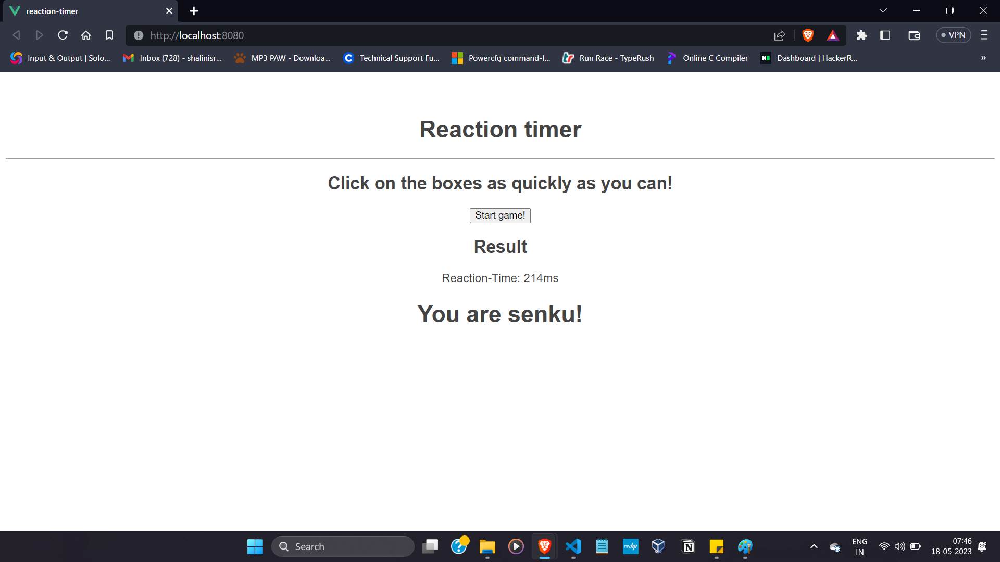

# reaction-timer

       This is a vue project in which test your reaction time

## Project setup
```
npm install
```
this will install the dependencies of the project

### Compiles and hot-reloads for development
```
npm run serve
```
This will host the app in local network


### Customize configuration
See [Configuration Reference](https://cli.vuejs.org/config/).

### Screenshots


